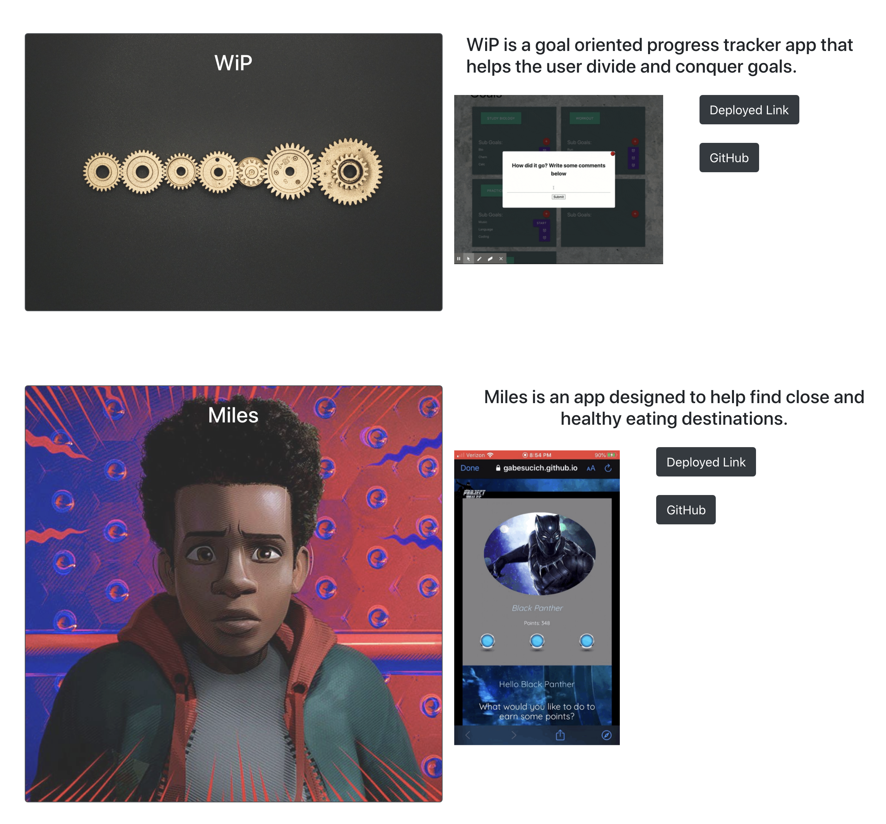

# React_Portfolio

<h2>
Deployed <a href="https://colin-whitcomb.github.io/React_Portfolio/">Site</a>
</h2>

<h3 align="center">
Projects
</h3>

    

## Summary & Processs

In this assignment our objective was to update our portfolio pages. I maintained a similar framework from before; however, I made some changes.

I made a different layout for UI and design. I condensed the site into one page that holds everything from project work, individual assignments, and an "about me" section. Unlike previous portfolios, this iteration takes advantage of React.js which compiles and renders JSX from multiple components.

Since I have been using Materialize for a while, I decided to go back to <a href="https://getbootstrap.com/">Bootstrap</a> to refresh on their components and grid system. 

## Screenshots 

<h3 align="center">

Top of Page - Includes links to Github / LinkedIn
</h3>

    

<h3 align="center">
About Me / Contact
</h3>

    

## Technologies / Resources
- React.js
- Bootstrap 
- JSX / CSS  
- Visual Studio Code
- Git / GitHub / GitPages

## Author

**Colin Whitcomb** [LinkedIn](https://www.linkedin.com/in/colin-whitcomb-b808301a6/)